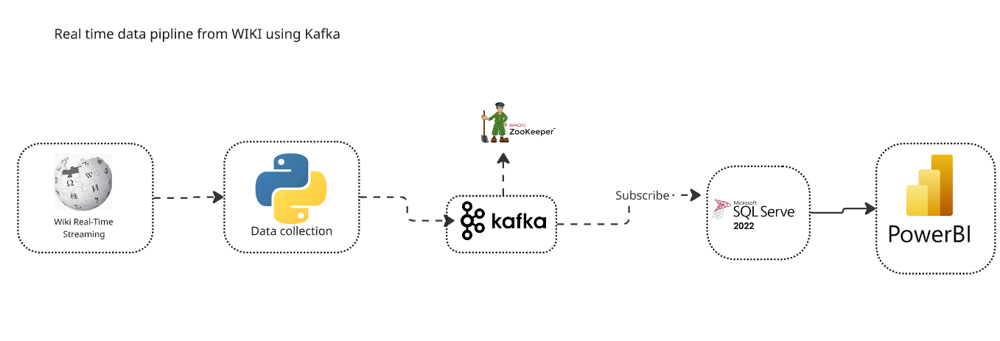
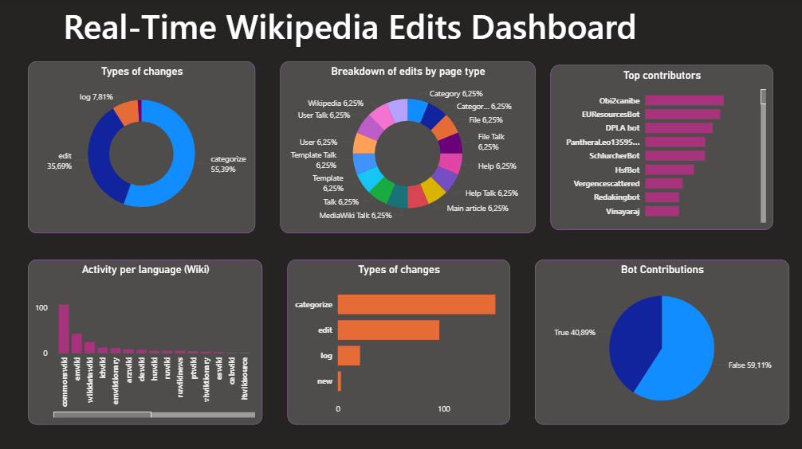

# Wikipedia Edit Streaming Analytics


*Illustration of the data pipeline from Wikipedia streaming to Power BI dashboard.*

## Table of Contents

* [Project Overview](#project-overview)
* [Technologies Used](#technologies-used)
* [Data Pipeline](#data-pipeline)
* [Repository Structure](#repository-structure)
* [How to Run](#how-to-run)
* [Dashboard](#dashboard)

---

## Project Overview

This project monitors and visualizes **real-time Wikipedia edits** using a complete data pipeline. It combines **Python**, **Kafka**, **SQL Server**, and **Power BI** to track edits, their types, namespaces, and whether they are made by humans or bots. The system provides actionable insights into Wikipedia activity.

---

## Technologies Used

* **Python**: For streaming, producing, and consuming Wikipedia data.
* **Kafka**: To handle real-time data streaming.
* **SQL Server**: To store the structured data.
* **Power BI**: For interactive data visualization.
* **Libraries**: `sseclient`, `kafka-python`, `pyodbc`, `pandas`.

---

## Data Pipeline

The data pipeline is organized as follows:

1. **Wikipedia EventStream**

   * Source: [Wikimedia EventStream API](https://stream.wikimedia.org/v2/stream/recentchange)
   * Emits events for every Wikipedia change in real-time.

2. **Producer (Python + Kafka)**

   * Listens to the Wikipedia stream using **SSEClient**.
   * Extracts key fields: timestamp, wiki project, username, article title, type of change, namespace, and bot indicator.
   * Sends processed data to Kafka topic **`wiki-changes`**.

3. **Consumer (Python + SQL Server)**

   * Consumes messages from the Kafka topic.
   * Inserts data into **`wiki_changes`** table.

4. **Power BI Dashboard**


* Interactive Power BI dashboard showing:

  * Number of edits in the last 5 minutes (gauges).
  * Distribution of edits by type and namespace.
  * Bot vs Human edits comparison.
  * Filters and slicers for specific articles or namespaces.


---


## How to Run

### 1. Kafka

* Install Kafka and Zookeeper.
* Create the topic `wiki-changes`.

### 2. Python Environment

```bash
pip install kafka-python pyodbc sseclient pandas
```

### 3. SQL Server

* Create the database `wiki_changes_db` and table:

```sql
CREATE TABLE wiki_changes (
    ts DATETIME,
    wiki NVARCHAR(255),
    username NVARCHAR(255),
    title NVARCHAR(255),
    type_change NVARCHAR(50),
    namespace_id INT,
    bot BIT
);
```

### 4. Run data_pipline

```bash
python data_pipeline.py
```


---


